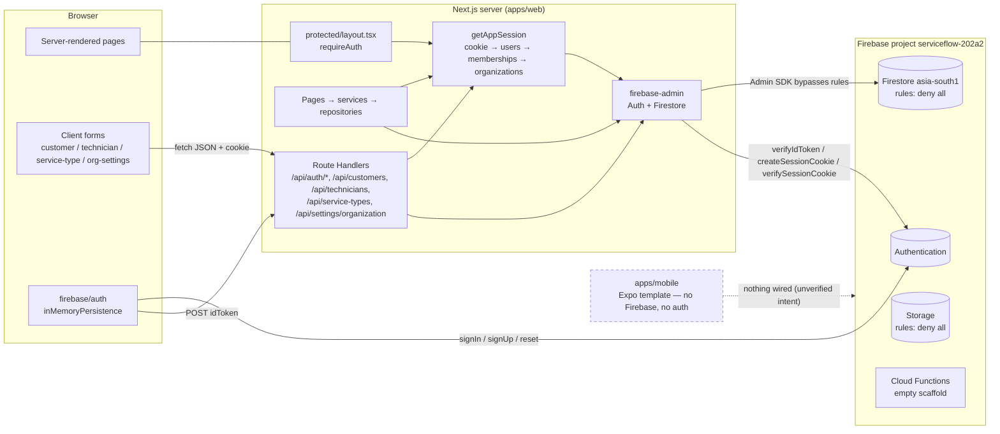

# ServiceFlow — Read-Only Architecture Audit

**Repository root:** `/Users/nspira/Desktop/serviceflow` (branch `serviceflow-development`, HEAD `46bbfc0`, 2026-09-30)
**Audit date:** 2026-09-30 · **Mode:** read-only inspection, no commands that write, install, build, deploy, or contact production
**Coverage:** 265 non-generated files enumerated; every `.ts/.tsx/.mjs` under `apps/web`, `apps/mobile`, `packages/domain`, `functions`, plus all Firebase config, rules, indexes, lockfile metadata and docs were read. Excluded from inspection: `node_modules/`, `apps/web/.next/`, `apps/mobile/.expo/`, binary image assets. Nothing was modified.

Evidence citations use repository-relative paths and line numbers as they exist at HEAD. Each finding is tagged **Confirmed** (read directly in code), **Inferred** (reasoned from code without execution), or **Unverified** (depends on environment or console state not visible in the repo).

---

## A. Executive Summary

ServiceFlow is an npm-workspaces monorepo containing a **Next.js 16.3.6 App Router web application** (`apps/web`), an **Expo SDK 57 / React Native 0.86 mobile scaffold** (`apps/mobile`), a **type-only domain package** (`packages/domain`), and an **empty Cloud Functions scaffold** (`functions`). The backend is Firebase project `serviceflow-202a2` (Firestore in `asia-south1`, Authentication, Storage rules declared).

**The actual architecture is "server-only Firebase":** Firestore and Storage rules deny every client read and write (`firestore.rules:8-10`, `storage.rules:8-10`), and the web app performs *all* data access through the Firebase Admin SDK inside Next.js Server Components and Route Handlers. The browser touches Firebase only for Authentication (sign-in, sign-up, password reset), then exchanges the ID token for an HttpOnly session cookie (`apps/web/src/app/api/auth/session/route.ts`). Tenant isolation is therefore enforced entirely in application code, not in rules.

**Major strengths (verified):**
- The server-side tenant model is disciplined. Every repository derives `organizationId` from the trusted `AppSession` (never from the client), filters queries by it, and re-checks ownership on every document after the read (`customer.repository.ts:40-47`, `technician.repository.ts:43-46`, `service-type.repository.ts:32-34`, `dashboard.repository.ts:14-16`). No cross-tenant read or write path was found.
- Mutations are strict-schema validated with Zod (`.strict()` rejects client-supplied `organizationId`/`version`/audit fields), idempotent via client `requestId`, optimistically versioned, and transactional with audit-log writes.
- Session creation requires a verified email and a login within the last 5 minutes; session cookies are checked for revocation on every request (`session.ts:19`).
- `.env.local` is untracked, the Admin credential path points outside the repository, and no secret material is committed.

**Major risks (verified):**
1. **Redirect loop for authenticated users without a valid ServiceFlow profile.** A valid session cookie whose user/membership/organization is missing or inactive bounces forever between `/login` and `/dashboard` (F-01).
2. **Unverified-email and other login failures surface as "Something went wrong"** because non-Firebase errors are mapped to a generic message (F-02).
3. **The Technicians feature is unreachable end-to-end**: no code path creates a `TECHNICIAN` membership, and technician creation requires one (F-03).
4. **The mobile app is an untouched Expo template**: no auth, no Firebase, no ServiceFlow screens; `src/lib/firebase/*.ts` are zero-byte files (F-04).
5. **Logout does not revoke server-side sessions**; a stolen cookie stays valid for up to 5 days (F-05).
6. **No CI, no test runner, no CSP/security headers, four divergent CSRF checks, four nested lockfiles, and 15 commits titled "some changes"** — delivery hygiene is the weakest area.

**Current unknowns:** the *deployed* Firestore/Storage rules, Firebase Auth settings (email enumeration protection, authorized domains), API-key restrictions, App Check, hosting platform and proxy headers, and whether any production data exists. None of these can be established from the repository.

---

## B. Repository and Architecture Map

```
serviceflow/                         npm workspaces root (package.json: apps/*, packages/*, functions)
├── .firebaserc                      default project: serviceflow-202a2
├── firebase.json                    firestore (asia-south1) + functions + storage + emulators
├── firestore.rules                  deny-all
├── firestore.indexes.json           17 composite indexes (customers, technicians, serviceTypes, memberships, jobs, serviceRequests)
├── storage.rules                    deny-all
├── firestore-debug.log              emulator log, untracked (ignored via *.log)
├── docs/*.md                        six phase write-ups (app shell, dashboard, org settings, customers, technicians, service types)
├── scripts/                         empty
├── firebase/                        empty
├── functions/                       Cloud Functions scaffold — src/index.ts only sets maxInstances; no functions exported
├── packages/domain/                 @serviceflow/domain — TypeScript interfaces + job state machine; NOT imported by any app
└── apps/
    ├── web/                         Next.js 16.3.6, React 19.2.8, Tailwind 4, shadcn/base-ui, zod 4, firebase 12, firebase-admin 14
    │   ├── next.config.ts           redirect / → /login; rewrites /dashboard, /customers… → /protected/*
    │   ├── components/ui/           shadcn primitives (outside src/)
    │   ├── scripts/test-*.mjs       six bespoke assertion scripts (node --experimental-strip-types)
    │   └── src/
    │       ├── app/
    │       │   ├── (auth)/          login, register, forgot-password, auth-error  (layout redirects if cookie valid)
    │       │   ├── (onbording)/     verify-email   [sic]
    │       │   ├── api/             auth/{session,logout,me,register}, customers, technicians, service-types, settings/organization
    │       │   └── protected/       layout (requireAuth) → dashboard, customers, technicians, service-types, settings/organization
    │       ├── lib/
    │       │   ├── firebase/        admin.ts (server-only), client.ts, config.ts, emulator.ts
    │       │   ├── auth/            session.ts, app-session.ts, require-auth.ts, authorization.ts, permissions.ts, constants.ts
    │       │   └── utils/
    │       ├── features/<name>/     components / repositories / schemas / services / types  (customers, technicians,
    │       │                        service-types, organization-settings, dashboard, auth, app-shell, service-requests*)
    │       └── components/providers/app-providers.tsx   fully commented out
    └── mobile/                      Expo 57 template: src/app/{_layout,index,explore}.tsx, theme components; src/lib/firebase/* empty
```
`*` `service-requests` contains schema/types/error/workflow files only — no repository, route, or page consumes them.

**Dependency direction (web):** `app/*` → `features/*/services` → `features/*/repositories` → `lib/firebase/admin` + `lib/auth/*`. Client components (`features/*/components/*-form.tsx`) call Route Handlers via `fetch`. This layering is consistent across the four CRUD features.

---

## C. Technology Inventory

| Area | Technology | Version (installed) | Actual use |
|---|---|---|---|
| Monorepo | npm workspaces | root `package-lock.json` (661 KB) | `apps/*`, `packages/*`, `functions` |
| Web framework | Next.js | 16.3.6 (`apps/web/node_modules/next`) | App Router, RSC, Route Handlers; no middleware/proxy, no Server Actions |
| UI | React / React DOM | 19.2.8 | — |
| Styling | Tailwind CSS 4, `tw-animate-css`, shadcn (base-ui) | `^4` / 4.21.0 | `components/ui/*` |
| Forms/validation | react-hook-form 7.89, zod | 4.6.5 | client + server schemas |
| Firebase client | `firebase` | 12.19.0 | **Auth only** in practice; Firestore/Storage instances created but unused |
| Firebase server | `firebase-admin` | 14.5.0 (web, nested), 13.10.0 (root/functions) | Auth verify/session cookies, Firestore |
| Cloud Functions | `firebase-functions` 7, Node engine 24 | scaffold | no functions exported |
| Mobile | Expo SDK 57.0.25, React Native 0.86.3, expo-router 57, React 19.2.3, reanimated 4.5 | template | no Firebase dependency |
| Language | TypeScript | web 5.9.3; mobile `~6.0.3`; functions `^6.0.0`; domain `^7.0.2` | four different majors declared |
| Lint | ESLint 9 (`eslint-config-next`) web; ESLint 8 + google config functions | — | no Prettier, no lint-staged |
| Tests | `node:assert` + `node:vm` bespoke scripts | — | no runner (no vitest/jest/playwright) |
| CI/CD | none | — | no `.github`, no husky |
| Node (local machine) | v22.23.2 | — | functions declare Node 24 |
| Firebase project | `serviceflow-202a2`, Firestore `asia-south1` | — | emulators: auth 9099, firestore 8080, functions 5001, storage 9199 |

Unknown: Hosting platform (Vercel? Firebase Hosting? none configured), production Node runtime, whether Firestore rules/indexes have been deployed.

---

## D. Architecture Diagrams

### D.1 Current system architecture



### D.2 Authentication flow (registration → verification → login → session)

```mermaid
sequenceDiagram
  participant B as Browser (auth.client.ts)
  participant FA as Firebase Auth
  participant R as /api/auth/register
  participant S as /api/auth/session
  participant FS as Firestore (Admin)

  Note over B: registerOwner()
  B->>FA: createUserWithEmailAndPassword + updateProfile
  B->>FA: getIdToken(true)
  B->>R: POST Bearer idToken {fullName, companyName}
  R->>FA: verifyIdToken (email_verified NOT required)
  R->>FS: read users/{uid}; if defaultOrganizationId → alreadyProvisioned
  R->>FS: batch: users, organizations, memberships(OWNER), organizationSettings, auditLogs
  B->>FA: sendEmailVerification, signOut
  B-->>B: router → /verify-email

  Note over B: loginWithEmail()
  B->>FA: signInWithEmailAndPassword
  alt emailVerified == false
    B-->>B: throw Error("EMAIL_NOT_VERIFIED") → shown as "Something went wrong" (F-02)
  end
  B->>S: POST {idToken} (Origin check)
  S->>FA: verifyIdToken; require email_verified && auth_time ≤ 5 min
  S->>FA: createSessionCookie (5 days)
  S-->>B: Set-Cookie serviceflow_session (HttpOnly, Lax, Secure in prod)
  B->>FA: signOut (client state discarded)
  B-->>B: router → /dashboard

  Note over B: Every protected request
  B->>S: cookie
  S->>FA: verifySessionCookie(cookie, checkRevoked=true)
  S->>FS: users/{uid}, memberships/{org_uid}, organizations/{org}
  alt any missing/inactive
    S-->>B: redirect /login → (auth)/layout sees valid cookie → redirect /dashboard → loop (F-01)
  end
```

### D.3 Core data flow — create customer (representative of all four CRUD features)

```mermaid
sequenceDiagram
  participant F as customer-form.tsx (client)
  participant H as POST /api/customers
  participant A as requireAuth / hasPermission
  participant Rp as customer.repository.createCustomer
  participant FS as Firestore transaction

  F->>F: zod customerFormSchema (client); requestId = randomUUID (kept across retries)
  F->>H: fetch JSON {…values, requestId}
  H->>H: isCustomerRequestSameOrigin (Origin + Sec-Fetch-Site)
  H->>A: session; role ∈ manageCustomers
  H->>H: parseCustomerRequest: content-type, ≤16 KB, strict schema
  H->>Rp: createCustomer(session, data)
  Rp->>Rp: docId = cus_sha256(org, uid, requestId)
  Rp->>FS: get customers/{docId} (idempotent replay check)
  Rp->>FS: get customerCounters/{orgId}; guard legacy tenants
  Rp->>FS: create customer + set counter + create auditLog
  FS-->>H: CustomerDetail
  H->>H: revalidatePath('/protected/customers')
  H-->>F: 201 {customer} (Cache-Control: no-store)
  F->>F: validate response schema; router.replace(/customers/{id}); refresh
```

---

## E. Findings Register

**Severity criteria used:** *Critical* — verified exploitable cross-tenant access, secret exposure, or data destruction. *High* — verified defect that blocks a core user flow or a security control gap exploitable without unusual preconditions. *Medium* — defect or hardening gap with real user/operational impact under plausible conditions. *Low* — quality or consistency issues with limited direct impact. *Informational* — observations and unverifiable items. No Critical findings were identified.

| ID | Sev | Category | Finding | Evidence | Impact | Conf. | Remediation (proposal only) |
|---|---|---|---|---|---|---|---|
| F-01 | High | Correctness / Auth | A valid Firebase session cookie whose ServiceFlow profile is missing/inactive causes an infinite redirect loop: `(auth)/layout` redirects to `/dashboard` on any valid cookie, `protected/layout` → `requireAuth` → `getAppSession` returns `null` → redirect `/login`. `/api/auth/session` only checks `email_verified`, not the profile, so the cookie is issued regardless. | `apps/web/src/app/(auth)/layout.tsx:12-16`; `lib/auth/require-auth.ts:8-13`; `lib/auth/app-session.ts:45-57,80-92,116-128`; `api/auth/session/route.ts:49-60` | Users whose registration batch failed after Auth signup, deactivated users, suspended organizations, or any manually edited data get a browser loop with no way to sign out. | Inferred (code path traced, not executed) | Issue the session cookie only after `getAppSession`-equivalent checks succeed; make `(auth)/layout` use `getAppSession` (or clear the cookie) instead of the raw Firebase session; render a "profile not ready / contact owner" page instead of redirecting. |
| F-02 | High | Correctness / UX | Non-Firebase errors thrown during login/registration (`EMAIL_NOT_VERIFIED`, "Unable to establish session.", "Recent authentication is required", registration API failures) are mapped by `getFirebaseAuthError` to "Something went wrong" because they are not `FirebaseError` instances. | `features/auth/services/auth.client.ts:164-168,184-188`; `lib/utils/firebase-error.ts:4-6`; `components/login-form.tsx:47-50`; `register-form.tsx:68-71` | Unverified users cannot learn why login fails; registration API errors (which the route deliberately populates with a message) are discarded. | Confirmed | Introduce an app-level `AuthError` with codes; map `EMAIL_NOT_VERIFIED` to a "verify your email / resend" state. |
| F-03 | High | Correctness / Readiness | No code path creates a non-OWNER membership (only `register/route.ts` writes `memberships`, always role `OWNER`). `createTechnician` requires an existing `ACTIVE` `TECHNICIAN` membership and an active user. The Technicians feature and the `TECHNICIAN` dashboard scope are therefore unreachable without manual Firestore edits. | `api/auth/register/route.ts:145-157`; `technicians/repositories/technician.repository.ts:64-72,83-89,204`; `dashboard.repository.ts:44-55` | Feature shipped as UI + API but not usable end-to-end; invitations/membership management are absent. | Confirmed | Implement invitations/membership creation (server-side, OWNER/ADMIN only) before relying on technicians. |
| F-04 | High | Readiness / Mobile | `apps/mobile` is the unmodified Expo template ("Welcome to Expo"). No Firebase dependency, no auth, no navigation beyond two template tabs; `src/lib/firebase/{client,config,emulator}.ts` are 0 bytes. | `apps/mobile/src/app/index.tsx:31-40`; `apps/mobile/package.json` (no firebase); `apps/mobile/src/lib/firebase/*` (empty) | Phase 3 of this audit cannot assess auth lifecycle, secure storage, offline, push, or release readiness — they do not exist. | Confirmed | Decide the mobile data-access model first (see §M); current deny-all rules mean the mobile app cannot use the client SDK for data without either rules work or a server API. |
| F-05 | Medium | Security / Session | Logout only clears the cookie; it never calls `adminAuth.revokeRefreshTokens(uid)`. Since `verifySessionCookie(cookie, true)` honours revocation, revoking on logout would invalidate stolen cookies; today they remain valid up to `SESSION_EXPIRES_IN` (5 days). | `api/auth/logout/route.ts:5-21`; `lib/auth/session.ts:19`; `lib/auth/constants.ts:3` | Session theft window of up to 5 days; no "sign out everywhere". | Confirmed | Read the cookie in the logout handler, verify it, call `revokeRefreshTokens(uid)`, then clear. Consider a shorter cookie lifetime with silent renewal. |
| F-06 | Medium | Security / CSRF | Four different same-origin implementations: `session/route.ts:17-28` (Origin only), `settings/organization/route.ts:7-10` (Origin only), `customer-api.ts:7-11` (Origin + Sec-Fetch-Site), `technician-api.ts:10-20` / `service-type-api.ts:7-15` (Origin vs `Host` + `X-Forwarded-Proto`). `logout/route.ts` has no check at all. The `X-Forwarded-Proto`/`Host` variant trusts proxy headers unconditionally. | files cited | Inconsistent protection; drift invites gaps as features are added; cross-site logout is possible (low impact). Correctness of the Host-based variant depends on a trusted proxy (unverified). | Confirmed | One shared `assertSameOrigin(request)` in `lib/http/` used by every mutating handler; document the trusted-proxy assumption. |
| F-07 | Medium | API contract | `requireAuth()` calls `redirect("/login")` and `requirePermission()` calls `notFound()` from inside Route Handlers, so JSON APIs answer with 307/404 HTML instead of 401/403 JSON. The customer form works around it by checking `response.redirected`. | `lib/auth/require-auth.ts:12`; `lib/auth/authorization.ts:9`; `api/settings/organization/route.ts:19`; `customers/components/customer-form.tsx:80-83` | Fragile client handling; any future mobile/API consumer receives HTML redirects. | Confirmed | Provide `getSessionOrThrow()` for handlers returning `401/403` JSON; keep `redirect/notFound` for pages only. |
| F-08 | Medium | Security headers | No security headers (CSP, HSTS, `X-Frame-Options`/`frame-ancestors`, `Referrer-Policy`, `Permissions-Policy`) and no middleware/proxy file. | `apps/web/next.config.ts:1-22` (no `headers()`); no `middleware.ts`/`proxy.ts` | Clickjacking and XSS blast-radius reduction rely entirely on the hosting layer (unverified). | Confirmed (repo) / Unverified (hosting) | Add `headers()` in `next.config.ts` or a `proxy.ts`; start with `frame-ancestors 'none'`, HSTS, nonce-based CSP if feasible. |
| F-09 | Medium | Cost / Latency | Every protected render performs one Auth API call (`verifySessionCookie` with `checkRevoked=true`) plus three Firestore document reads (`users`, `memberships`, `organizations`). `react.cache` dedupes only within one render; each Route Handler call repeats it. | `lib/auth/session.ts:19`; `lib/auth/app-session.ts:43,75-78` | Linear cost and ~3 sequential/parallel round-trips per navigation; at scale this dominates Firestore read spend. | Confirmed | Embed `organizationId`/`role`/`membershipVersion` as custom claims (refreshed on membership change) or cache the profile with a short TTL keyed on uid + a `sessionVersion` field. |
| F-10 | Medium | Cost / N+1 | `listTechnicianMembers` issues, per membership on the page, one `users` read and one `technicians` query (up to 25 × 2 = 50 extra reads) with unbounded `Promise.all` concurrency. | `technicians/repositories/technician.repository.ts:151-168` | Each "New technician" page load costs ~51 reads; grows with members. | Confirmed | Denormalise `displayName/email` onto the membership, or batch with `getAll()` and a single `technicians` query filtered by `userId in [...]` (chunks of 30). |
| F-11 | Medium | Shared code | `@serviceflow/domain` is imported by nothing (`grep` for `@serviceflow/domain` across apps/functions: no matches). Enums are duplicated and already diverge: `OrganizationRole` includes `CUSTOMER` in the domain package but not in the web app; `JobStatus`, technician statuses and `ServiceRequestStatus` are re-declared in web zod schemas; `Customer.email` is optional in domain but a required string in web. `index.ts` omits `common`, `audit`, and five empty files. | `packages/domain/src/membership.ts:1-8` vs `apps/web/src/features/auth/types/app-session.ts:1-7`; `packages/domain/src/job.ts:1-20` vs `apps/web/src/features/dashboard/schemas/dashboard.schema.ts:10`; `packages/domain/src/index.ts` | The "shared" layer provides no sharing today; drift will widen when mobile is built. | Confirmed | Make the domain package the single source of zod schemas + inferred types (platform-independent), consumed by web (server + client) and mobile. |
| F-12 | Medium | Delivery / Testing | No CI, no test runner, no pre-commit hooks. Tests are six bespoke scripts using `node:vm` with hand-built Firestore fakes; several assertions are regexes over source text (brittle to refactors). They require `node --experimental-strip-types`. No rules tests, no integration/e2e, no mobile tests, `job-state-machine.test.ts` is empty. Git history is 15 commits all titled "some changes". | `apps/web/scripts/test-dashboard.mjs:45-47`; `test-organization-settings.mjs:70-83`; `apps/web/package.json` scripts; `packages/domain/src/job-state-machine.test.ts` (0 bytes); `git log` | Regressions are caught only if someone runs six scripts by hand; no reviewable history. | Confirmed | Adopt a runner (vitest or `node:test`), wire `npm test` at root, add a GitHub Actions workflow (lint, typecheck, tests, `firebase emulators:exec` rules tests), enforce Conventional Commits. |
| F-13 | Medium | Dependency hygiene | Nested lockfiles in every workspace (`apps/web`, `apps/mobile`, `functions`, `packages/domain`) alongside the root lockfile; two `firebase-admin` majors (14.5.0 web, 13.10.0 root/functions); four TypeScript majors declared (`^5`, `~6.0.3`, `^6.0.0`, `^7.0.2`); ESLint 8 (functions) vs 9 (web); functions require Node 24 while the dev machine runs 22.23; React 19.2.8 (web) vs 19.2.3 (mobile). | package.json files; `git ls-files` shows all lockfiles tracked | Non-deterministic installs, duplicate Admin SDK instances, incompatible tooling between packages. | Confirmed | Single root lockfile; align `firebase-admin`, `typescript`, `eslint`; add `.nvmrc`/`engines`. |
| F-14 | Low | Correctness / Config | `next.config.ts` redirects `/` → `/login` while `src/app/page.tsx` redirects `/` → `/dashboard` (dead code; config wins). Rewrite `/login → /auth/login` targets a path that does not exist (route groups add no segment); it is inert because filesystem routes win, but misleading. | `apps/web/next.config.ts:4-10`; `src/app/page.tsx:3-5` | Confusing routing; unauthenticated `/` visitors go to `/login` instead of being bounced via the protected layout — acceptable, but two sources of truth. | Confirmed | Remove the inert rewrite and the dead page redirect. |
| F-15 | Low | Performance / Bundle | The web client initialises Firestore and Storage SDKs although only Auth is used (rules forbid client data access anyway). `firebaseConfig` uses non-null assertions with no runtime validation. | `lib/firebase/client.ts:1-12`; `lib/firebase/config.ts:1-8` | Extra client JS shipped on auth pages; misconfiguration surfaces late. | Confirmed | Export only `auth`; validate `NEXT_PUBLIC_*` with zod at module load. |
| F-16 | Low | Correctness / Race | `register/route.ts` checks "already provisioned" with a plain read then a batch, not a transaction; two concurrent calls for the same uid can create two organizations, the second overwriting `defaultOrganizationId`. | `api/auth/register/route.ts:73-85,115-193` | Orphan organization + audit row; unlikely but possible on double-submit/retry. | Inferred | Wrap in `runTransaction` with `transaction.get(userRef)` guard, or `create()` the user doc (fails if exists). |
| F-17 | Low | Security / Abuse | `/api/auth/register` does not require `email_verified` and has no rate limit; any Firebase account (verified or not) can provision one org. The endpoint is idempotent per uid, so amplification is bounded by account creation. | `api/auth/register/route.ts:31-47` | Junk organizations from unverified signups; storage/audit noise. | Confirmed | Acceptable for now if Auth-level abuse protection is enabled (unverified); consider deferring provisioning until first verified login. |
| F-18 | Low | Dead code / Hygiene | Empty or commented-out files: `features/auth/context/auth-provider.tsx`, `hooks/use-auth.ts`, `types/auth.types.ts`, `components/providers/app-providers.tsx` (all commented), `packages/domain/src/{audit,inventory,invoice,notification,payment,quotation}.ts`, `job-state-machine.test.ts`, `apps/mobile/src/lib/firebase/*`. `features/service-requests` (schemas/types/workflow) has no consumer. Folder typo `(onbording)`. `scripts/` and `firebase/` root dirs are empty. | paths cited | Misleads readers about implemented scope. | Confirmed | Delete or mark WIP explicitly. |
| F-19 | Low | Consistency | Two component roots (`apps/web/components/ui` outside `src/`, everything else under `src/`); tsconfig `paths` `@/*` → `./*` so imports mix `@/components/...` and `@/src/...`. Formatting is inconsistent (dashboard files are written in a minified single-line style; no Prettier config). | `apps/web/tsconfig.json:21-23`; `features/dashboard/repositories/dashboard.repository.ts`; `dashboard.service.ts` | Readability and review friction. | Confirmed | Move `components/ui` under `src/`, set `@/*` → `./src/*`, add Prettier. |
| F-20 | Low | Logging | `console.log` of uid and "Firestore connection OK" in the register route; Admin init logs emulator env in dev; per-request `console.warn` with uid/membership ids in `getAppSession`. No structured logger or request id. | `api/auth/register/route.ts:33,77,195`; `lib/firebase/admin.ts:15-27`; `lib/auth/app-session.ts:46,54,65,81,89` | Noisy logs; PII (uid) in plain logs; hard to correlate. | Confirmed | Introduce a small logger with levels and redact identifiers in production. |
| F-21 | Low | Data lifecycle | `auditLogs` grow unbounded (every create/update); no retention or TTL policy; no delete/archival paths for customers/technicians/service types (only `isActive`/status). | repositories cited (`auditRef` in each) | Storage growth; fine at current scale. | Confirmed | Define a TTL policy (Firestore TTL field) once volumes are known. |
| F-22 | Info | Rules | Firestore and Storage rules are deny-all; correct for the current server-only model. Admin SDK bypasses rules, so isolation is 100 % code-enforced. Whether these rules are what is *deployed* cannot be verified from the repo. | `firestore.rules:8-10`; `storage.rules:8-10` | If a client SDK data path is ever added (mobile), rules must be authored first. | Confirmed (repo) / Unverified (deployed) | Verify with `firebase firestore:rules:get`-style console review; add rules unit tests before any client access. |
| F-23 | Info | Secrets | No committed secrets: `.env.local` untracked (`.env*` ignored), `GOOGLE_APPLICATION_CREDENTIALS` resolves outside the repository, no service-account JSON, keystore, or plist files present. `.firebaserc` project id and `NEXT_PUBLIC_FIREBASE_*` are public by design. App Check is not referenced anywhere. | `git ls-files`, `find` results; `apps/web/.env.local` key names only | API key restrictions and App Check status are console settings (unverified). | Confirmed / Unverified | Restrict the browser API key by HTTP referrer; evaluate App Check for Auth. |
| F-24 | Info | Functions | `functions/src/index.ts` exports nothing; `firebase deploy --only functions` would deploy zero functions but run lint+build predeploy. | `functions/src/index.ts:10-32`; `firebase.json:8-20` | None today. | Confirmed | Remove from `firebase.json` until needed, or keep as scaffold with a README note. |
| F-25 | Info | Tenancy model | Single-organization-per-user: `users.defaultOrganizationId` is the only tenant pointer; no organization switching, invitations, suspension flows, billing, plans, or entitlements exist in code. Membership doc id `orgId_uid` deterministically prevents duplicates. | `lib/auth/app-session.ts:62-73`; `register/route.ts:93-95` | Multi-org users are not supported; roles other than OWNER are unreachable (F-03). | Confirmed | See roadmap Phase 1/2. |

---

## F. Security and Tenant Isolation Audit

**Trust boundaries (verified):**
1. Browser → Firebase Auth (credentials). The browser never holds long-lived Firebase state (`inMemoryPersistence`, explicit `signOut` after cookie exchange, `auth.client.ts:65,156,194`).
2. Browser → Next.js server (session cookie + JSON). The cookie is HttpOnly, `SameSite=Lax`, `Secure` in production, 5-day lifetime (`session/route.ts:91-105`).
3. Next.js server → Firestore via Admin SDK (full privilege). This is the *only* data path; everything that keeps tenants apart lives in `getAppSession` and the repositories.

**Tenant scoping — how it is enforced:**
- `AppSession.organizationId` is derived server-side from `users/{uid}.defaultOrganizationId`, cross-checked against `memberships/{org_uid}` (userId + organizationId + status + role validity) and `organizations/{org}.status` (`app-session.ts:62-128`).
- Every list query starts with `.where("organizationId","==",session.organizationId)` (`customer.repository.ts:81`, `technician.repository.ts:104,138-139`, `service-type.repository.ts:59`, `dashboard.repository.ts:10-13`).
- Every single-document read (including pagination cursors) re-checks `organizationId` before parsing (`customer.repository.ts:43-45,90-99`; `technician.repository.ts:46,113-122`; `service-type.repository.ts:34,68-75`; `organization-settings.repository.ts:22-26,54-56`).
- Counters, name reservations and idempotency documents include and verify `organizationId` (`customer.repository.ts:137`; `technician.repository.ts:192-193,210-211`; `service-type.repository.ts:40-45`).
- Input schemas are `.strict()`, so a client cannot inject `organizationId`, `version`, `createdBy`, or audit fields (`customer.schema.ts:16-32`; `technician.schema.ts:18-34`; `service-type.schema.ts:16-33`; `organization-settings.schema.ts:24-36`).
- Role checks happen twice: at the route/service boundary (`requirePermission`/`hasPermission`) and again inside each repository (`assertSession`). UI hides navigation by role but the docs and code explicitly do not rely on that (`permissions.ts:18`, `authorization.ts:6`).

**Cross-tenant paths searched for and not found:** client-supplied tenant ids; `collectionGroup` queries; document ids used without ownership re-check; Admin reads keyed on request parameters without `organizationId` comparison; leaks through error messages (repositories throw typed errors; services log and rethrow generic messages, `customer.service.ts:22-23`, `dashboard.service.ts:11-15`).

**Verified issues:** F-01 (loop), F-05 (no revocation on logout), F-06 (CSRF drift, none on logout), F-07 (redirect from JSON APIs), F-08 (no headers), F-17 (unverified accounts may provision).

**Checks requiring production/console review (not verifiable here):** deployed rules equal repo rules; Auth email-enumeration protection and authorized domains; API key HTTP-referrer restrictions; App Check; hosting provider sets `X-Forwarded-Proto` trustworthily (F-06 depends on it); Firestore composite indexes deployed (`firestore.indexes.json` lists 17; the dashboard's `jobs` queries and all `nameSearch` prefix queries require them); Admin credentials in production come from workload identity rather than a key file.

---

## G. Web Application Audit

**Actual architecture.** App Router with three groups: `(auth)` public pages, `(onbording)` verify-email, and a literal `protected/` segment gated by `protected/layout.tsx` calling `requireAuth()`. Public URLs (`/dashboard`, `/customers/*`, …) are rewritten to `/protected/*` in `next.config.ts:7-19`; the `/protected/*` URLs are also reachable directly (same guard, so harmless). There is no middleware/proxy; auth is enforced per-render in the layout and repeated in every page/service via `requirePermission` (deduped by `react.cache`).

Rendering: all data pages are async Server Components reading `cookies()`, hence dynamic; no `use cache`, `unstable_cache` or ISR anywhere, so there is **no cross-tenant cache risk** today. Mutations go through Route Handlers (`POST/PATCH`), followed by `revalidatePath` (`api/customers/route.ts:19`) — with fully dynamic pages this is redundant but harmless. No Server Actions are used.

Server/client boundary: Admin SDK modules import `"server-only"` (`admin.ts:1`, all repositories/services), and no client component imports `adminDb`. Client components are limited to forms, the shell (sidebar/user-menu via base-ui), auth forms and error boundaries (25 files). Error boundaries use the `retry` prop, which Next 16.3.6 does provide alongside `reset` (verified in `node_modules/next/dist/client/components/error-boundary.d.ts:5-6`), so that is not a bug.

**Strengths.** Consistent feature slices (components/repositories/schemas/services/types); strict Zod at every boundary including *response* validation in forms (`customer-form.tsx:23-29,106-110`); body-size and content-type guards on JSON handlers; idempotent creates with stable `requestId` retained across retries; optimistic concurrency with `version`; typed error → HTTP status mapping; Unicode-aware prefix search bounds; timezone-correct day ranges (`dashboard/utils/date.ts:7-16`); good accessibility hygiene (`aria-*`, `role="alert"`, focus management, `beforeunload` guard).

**Problems (evidence in §E).** F-01, F-02, F-06, F-07, F-08, F-14, F-15, F-19, F-20. Additionally: `getFirebaseAuthError` maps `auth/email-already-in-use` to "Unable to sign in", which is wrong on the registration form (`firebase-error.ts:21-22`). The `/api/auth/me` endpoint exists but nothing calls it (dead).

**Performance.** Server-first design keeps client JS small; fonts via `next/font`. Watch items: F-09 (per-request auth cost), F-10 (N+1), F-15 (unused SDK modules). `Promise.all` in `readOperations` fans out six queries per dashboard render (`dashboard.repository.ts:60-63`) — acceptable, but counts are billed per index entry scanned.

**SEO/i18n.** App is authenticated-only; metadata titles are set per page. No i18n; currency/dates are not yet handled beyond timezone.

**Environment/production readiness.** `admin.ts` throws at import if `FIREBASE_ADMIN_PROJECT_ID` is missing — good fail-fast. Client config not validated (F-15). No `output`, `images`, or `headers` config; production hosting target undefined.

---

## H. Mobile Application Audit

**Actual state (Confirmed):** `apps/mobile` is the Expo SDK 57 starter with `expo-router`, two template screens (`index.tsx` "Welcome to Expo", `explore.tsx`), theme hooks, and animated splash. `app.json` slug/name are `mobile`, scheme `mobile`, experiments `typedRoutes` and `reactCompiler` on. No `firebase`, `@react-native-firebase/*`, `expo-secure-store` or `async-storage` dependency. `src/lib/firebase/{client,config,emulator}.ts` are empty files. `.claude/settings.json` and `.vscode/*` are tracked.

**Consequences for the platform:** Because Firestore/Storage rules deny all client access, a mobile app using the Firebase client SDK cannot read or write *anything* today. Two viable models exist and the choice is architectural (see §M): (a) mobile talks to the same Next.js Route Handlers (bearer ID token instead of cookie) — reuses all server-side tenant logic; or (b) mobile uses the client SDK with newly authored, tested tenant-scoped rules plus custom claims — requires duplicating the authorization model in rules.

**Not assessed (do not exist):** auth lifecycle, secure token storage, deep links, push, offline, pagination, crash reporting, signing/release config.

**Template hygiene:** `scripts/reset-project.js`, sample images and `expo-badge` assets are template leftovers; `LICENSE` is the template MIT license.

---

## I. Firebase and Data Model Audit

**Services in use (from code):** Authentication (email/password, email verification, password reset, session cookies); Cloud Firestore (`(default)`, `asia-south1`). **Declared but unused:** Storage (deny-all rules, `getStorage` on client unused), Cloud Functions (empty), Emulator Suite (auth, firestore, functions, storage, UI). **Not present:** Realtime Database, App Check, Hosting, Remote Config, Analytics, Crashlytics, FCM.

**Collections and relationships (from writes/reads in code):**

| Collection | Doc id | Written by | Read by | Notes |
|---|---|---|---|---|
| `users` | Firebase uid | register route | app-session, technician eligibility | `defaultOrganizationId`, `isActive` |
| `organizations` | auto | register route; settings update | app-session, org settings | `status` ACTIVE/SUSPENDED/CANCELLED |
| `memberships` | `{orgId}_{uid}` | register route (OWNER only) | app-session, technician members list | role, status; index on org+role+status |
| `organizationSettings` | `orgId` | register route; settings update | dashboard timezone, settings | prefixes JOB/INV/QUO, timezone (absent at registration → UTC default) |
| `customers` | `cus_{sha256(org,uid,requestId)}` | customer repo (tx) | customer repo | `nameSearch`, `version`, `creationKey` |
| `customerCounters` | `orgId` | customer repo (tx) | customer repo | per-tenant sequence, legacy-guarded |
| `technicians` | `tech_{sha256(org,userId)}` | technician repo (tx) | technician repo, dashboard | one profile per user per org by construction |
| `technicianCounters`, `technicianCreateRequests` | `orgId` / `sha256(org,uid,requestId)` | technician repo | technician repo | receipt pattern for idempotency |
| `serviceTypes`, `serviceTypeNames` | `st_{hash}` / `sha256(org,nameSearch)` | service-type repo (tx) | service-type repo | name uniqueness via reservation doc |
| `auditLogs` | auto | every mutation | nobody | unbounded (F-21) |
| `jobs`, `serviceRequests` | — | **no writer exists** | dashboard counts/lists | indexes exist; features not built |

**Consistency.** All multi-document writes use `runTransaction` or a batch; reads precede writes; server timestamps are used (`Timestamp.now()` inside transactions, `FieldValue.serverTimestamp()` in register/settings — mixed styles but both server-side). Sequence counters are single-document per tenant, which serialises creates per tenant (~1 write/s sustained per counter doc is the Firestore guidance) — fine for a field-service SaaS, worth knowing.

**Query/index review.** Every list query is `organizationId ==` + optional equality + `nameSearch` range + `orderBy(nameSearch, __name__)`; matching composite indexes exist for customers, technicians, serviceTypes (`firestore.indexes.json:3-98`). Dashboard `jobs` queries (org+scheduledAt, org+createdAt desc, org+status, org+assignedTechnicianId+…) are covered (`:99-194`). `technicians` `status in […] orderBy displayName` is covered (`:209-226`). `memberships` org+role+status is covered (`:49-58`). `count()` aggregations are used for KPIs (`dashboard.repository.ts:20-25`) — cost-efficient. Prefix search on `nameSearch` is exact-prefix only (no full-text); adequate for now.

**Cost/scalability risks:** F-09 (auth + 3 reads per request), F-10 (N+1), audit growth (F-21). No listeners, no unbounded reads — page sizes are capped at 25 (+1 lookahead).

**Rules:** deny-all; see §F. Since jobs/serviceRequests have no writer, any current data there was seeded manually or by the emulator.

---

## J. Shared Code and Duplication Audit

**Duplicated today (web-internal):** `prefixUpperBound`, `normalize*Name`, `singleLine`/`searchableName` refinements, `timestampToIso`, `assertSession`, JSON body parsing, same-origin checks, and error → status mapping are copy-pasted across customers, technicians and service-types with small drifts (e.g. streaming body limit in technician/service-type parsers vs `request.text()` in customers; `hasPermission` vs `requirePermission` at route level). This is the primary maintainability cost in the web app.

**Duplicated across packages:** enums and entity shapes between `packages/domain` and web (F-11).

**What should stay platform-specific:** Next.js Route Handler helpers, cookie/session code, Admin SDK repositories (server-only), React Native navigation/storage.

**What is safe to share (platform-independent):** zod schemas and inferred types for every entity and API payload; permission matrix (`PERMISSION_ROLES`, `hasPermission`) — already pure; job/service-request state machines; name normalisation and search-bound helpers; API error codes. All of these are pure TypeScript with no DOM/Node/native imports, so `packages/domain` (already in the workspace) can host them without a build step if consumers import source (`moduleResolution: bundler` in web; Metro handles TS in mobile).

**Unsafe sharing to avoid:** anything importing `next/*`, `firebase-admin`, `node:crypto` (used in repositories), `server-only`, or `react-native`.

**Recommendation:** no monorepo migration is needed — it *is* a monorepo. The gap is that the shared package is unused. Move schemas + permissions + state machines into `@serviceflow/domain`, add it as a dependency of `apps/web` (and later mobile), and delete the web copies.

---

## K. Testing and Delivery Audit

**Existing tests (Confirmed):** six scripts in `apps/web/scripts/`, ~2,000 lines, exercising schemas, repository authorization (with an in-memory Firestore fake that enforces "reads before writes"), cursor tenant checks, idempotency, and navigation. They are valuable — several assert exactly the isolation properties this audit relied on — but they are: not discoverable by a runner, not aggregated (`npm test` does not exist at root or in web), partially regex-on-source (`test-dashboard.mjs:45-47`, `test-organization-settings.mjs:70-83`), and dependent on Node's experimental type stripping. `packages/domain` has an empty test file. There are no rules tests (rules are deny-all, so a two-line emulator test would still lock that in), no Route Handler/integration tests, no e2e, no mobile tests.

**Lint/format:** ESLint via `eslint-config-next` (web), google config (functions); no Prettier; no lint on `packages/domain`.

**CI/CD/release:** none. No workflow files, no hooks, no version tags, no changelog, commit messages uninformative. `firebase.json` predeploy runs lint+build for functions only. No deployment definition for the web app.

**Verification gap:** no evidence that `next build`, `tsc`, or the test scripts pass at HEAD (not executed by this audit; see §N).

---

## L. Prioritized Remediation Roadmap

Effort: S (< 1 day of focused work), M (days), L (week+). Time estimates are intentionally not given.

### Phase 0 — urgent verified security/correctness (blockers before inviting real users)
| # | Action | Reason | Deps | Areas | Effort | Risk | Acceptance criteria |
|---|---|---|---|---|---|---|---|
| 0.1 | Break the redirect loop (F-01): gate cookie issuance on a successful profile resolution, and make `(auth)/layout` decide on `getAppSession()` (clearing an unusable cookie) instead of the raw Firebase session | Users can be locked in a loop with no escape | — | `api/auth/session`, `(auth)/layout`, `lib/auth` | S | Low | A verified user with no `users` doc, inactive membership, or suspended org sees an explanatory page and can sign out; no `/login`↔`/dashboard` loop in a manual test |
| 0.2 | Surface real auth errors (F-02) | Unverified users cannot proceed | — | `auth.client.ts`, `firebase-error.ts`, forms | S | Low | "EMAIL_NOT_VERIFIED", stale-login (401), and registration API messages are shown verbatim/mapped; `email-already-in-use` shows the correct text on register |
| 0.3 | Revoke on logout (F-05) | Limits stolen-cookie window | — | `api/auth/logout` | S | Low | After logout, the old cookie value is rejected by `verifySessionCookie(…, true)` (emulator test) |
| 0.4 | Unify CSRF checks and cover logout (F-06) | Drift + uncovered endpoint | — | new `lib/http/same-origin.ts`, all mutating routes | S | Low | One implementation, unit-tested for origin/host/sec-fetch-site cases; every `POST/PATCH` handler imports it |

### Phase 1 — correctness and reliability
| # | Action | Reason | Deps | Areas | Effort | Risk | Acceptance |
|---|---|---|---|---|---|---|---|
| 1.1 | JSON APIs return 401/403 JSON, never redirects (F-07) | API contract for web + future mobile | 0.4 | `lib/auth`, routes, forms | S | Low | Handlers never call `redirect/notFound`; forms drop the `response.redirected` workaround |
| 1.2 | Membership/invitation flow (F-03, F-25) | Technicians unusable; roles unreachable | 0.1 | new `features/members`, register flow | M | Medium | OWNER/ADMIN can invite by email → `memberships` with role; invitee login resolves the org; technician creation works end-to-end |
| 1.3 | Transactional, verified-only registration (F-16, F-17) | Duplicate org race; junk orgs | — | `api/auth/register` | S | Low | Concurrent double POST yields exactly one org; unverified accounts cannot provision (or provisioning deferred to first verified login) |
| 1.4 | Security headers (F-08) | Baseline hardening | hosting decision | `next.config.ts`/`proxy.ts` | S | Medium (CSP can break fonts/inline styles) | Headers observed on every response; CSP report-only first |
| 1.5 | Test runner + CI (F-12) | Regressions invisible | — | root scripts, `.github/workflows` | M | Low | `npm test` runs all suites; CI runs lint, `tsc --noEmit` per workspace, tests, and `firebase emulators:exec` rules test on every PR |

### Phase 2 — maintainability and architecture
| # | Action | Reason | Deps | Areas | Effort | Risk | Acceptance |
|---|---|---|---|---|---|---|---|
| 2.1 | Make `@serviceflow/domain` real (F-11, §J) | Single source for schemas/enums/permissions | 1.5 | domain pkg, web imports | M | Low | Web imports schemas/roles from the package; duplicate enums deleted; `CUSTOMER` role decision recorded |
| 2.2 | Extract shared server helpers (body parsing, error mapping, `assertSession`, `prefixUpperBound`, `timestampToIso`) | Three near-identical copies | 2.1 | `lib/server/*` | S | Low | One implementation each; feature files shrink accordingly; tests still pass |
| 2.3 | Repo hygiene (F-13, F-14, F-18, F-19) | Determinism and readability | — | lockfiles, tsconfig, formatting | S | Low | One root lockfile; aligned TS/ESLint/firebase-admin; `.nvmrc`; Prettier; dead files removed; `@/*` → `src` |
| 2.4 | Structured logging (F-20) | Observability | — | `lib/logger` | S | Low | No raw `console.*` in server code; request id on errors |

### Phase 3 — performance, scalability, cost
| # | Action | Reason | Deps | Areas | Effort | Risk | Acceptance |
|---|---|---|---|---|---|---|---|
| 3.1 | Reduce per-request auth cost (F-09) via custom claims (`orgId`, `role`, `membershipVersion`) refreshed on membership change, keeping a cheap revocation check | 3 reads + 1 Auth call per render | 1.2 | app-session, membership writes | M | Medium (claim staleness) | Protected render performs ≤1 Firestore read; role change takes effect within the documented window |
| 3.2 | Fix N+1 in technician member list (F-10) | 50 reads per form | 2.2 | technician repo | S | Low | Form load ≤ 3 queries regardless of member count |
| 3.3 | Trim client Firebase bundle (F-15) | Unused SDK modules | — | `lib/firebase/client.ts` | S | Low | Firestore/Storage absent from auth-page chunks |
| 3.4 | Audit log retention (F-21) | Growth | — | Firestore TTL | S | Low | TTL field set; policy documented |

### Phase 4 — developer experience and long-term
| # | Action | Reason | Deps | Areas | Effort | Risk | Acceptance |
|---|---|---|---|---|---|---|---|
| 4.1 | Decide and build the mobile data-access model (§M) | Mobile is a blank slate | 1.1, 2.1 | `apps/mobile` | L | Medium | Auth + one vertical slice (e.g. technician "my jobs") working on Android/iOS against the chosen backend path |
| 4.2 | Decide the fate of `functions/` and Storage (delete scaffold or implement) | Empty scaffolds | — | `firebase.json` | S | Low | No dead deploy targets |
| 4.3 | Conventional commits, PR template, `docs/` upkeep | History is unusable | 1.5 | repo | S | Low | Commit lint in CI |

---

## M. Proposed Target Architecture (proposal, grounded in what exists)

Keep the **server-only Firebase** model for the web — it is the strongest part of the codebase. Grow it, rather than replace it:

```
serviceflow/
├── packages/
│   └── domain/                 zod schemas + types + enums + permissions + state machines (pure TS, no build step)
│       └── src/{organization,membership,user,customer,technician,service-type,job,service-request}.ts, permissions.ts
├── apps/web/src/
│   ├── lib/server/             session, app-session, same-origin, json-body, api-errors, logger   (server-only)
│   ├── lib/firebase/           admin.ts (server), auth-client.ts (browser: Auth only)
│   ├── features/<slice>/       components | repositories | services | (schemas re-exported from domain)
│   └── app/                    (auth) | (onboarding) | protected/* | api/*
├── apps/mobile/src/
│   ├── lib/api/                typed client for the same /api routes (bearer ID token) — reuses domain schemas
│   └── features/…
└── functions/                  only if/when server-side triggers are needed (e.g. membership → custom claims)
```

**Mobile trade-off.** Option A (mobile → existing Route Handlers with `Authorization: Bearer <idToken>`; handlers accept either cookie or bearer) reuses 100 % of the tenant logic, keeps rules deny-all, and needs F-07 fixed first; cost is that the web server becomes the API tier for mobile (hosting/latency considerations, no offline sync). Option B (client SDK + rules + custom claims) gives offline/realtime but requires writing and testing a full rules model that mirrors `PERMISSION_ROLES`, and every repository invariant (counters, reservations, idempotency) would have to move to Cloud Functions to stay trustworthy. Given the codebase's investment in server-side invariants, **Option A is the lower-risk default**; Option B can be adopted later for specific read-only, realtime screens.

**Migration boundaries:** (1) domain package extraction touches only imports; (2) `lib/server` extraction is mechanical; (3) bearer-token support in `getAppSession` is additive; (4) custom claims (3.1) change auth resolution and should ship behind a flag with the Firestore path as fallback.

---

## N. Verification Checklist (not executed by this audit)

All of the following may write caches/artifacts or contact services and therefore need your authorization:

- `npm ci` at root (single lockfile) → confirm install determinism and duplicate `firebase-admin` resolution.
- `npm --workspace apps/web run lint` and `npx tsc --noEmit -p apps/web` → typecheck at HEAD.
- `npm --workspace apps/web run build` → production build succeeds; inspect route table (dynamic everywhere) and client chunk sizes for auth pages (F-15).
- Run the six `test:*` scripts on Node ≥ 22.6 → confirm they pass today; convert to a runner (1.5).
- `npm run domain:check`, `npm --workspace functions run build` → typecheck packages.
- `firebase emulators:exec --only auth,firestore "…"` → (a) rules test asserting client read/write denied on every collection; (b) reproduce F-01 by creating an Auth user with verified email and no `users` doc, exchanging the ID token, and loading `/dashboard`; (c) reproduce F-05 by logging out and replaying the old cookie; (d) reproduce F-16 with two parallel register calls.
- Console review (read-only): deployed Firestore/Storage rules and indexes vs repo; Auth providers, email-enumeration protection, authorized domains; API key restrictions; App Check; service-account usage; hosting proxy headers.
- Manual: unverified login message; `/` → `/login` behaviour; direct `/protected/dashboard` access; CSRF probe from a foreign origin against `/api/auth/logout`.
- Mobile: `expo doctor` and a device build once any real code exists.

---

## O. Questions and Unknowns

1. Where will the web app be hosted, and does that layer set trustworthy `X-Forwarded-Proto`/`Host` headers? (Affects F-06 and F-08.)
2. Is mobile expected to reach Firestore directly (Option B) or through the web API (Option A)? This decides the rules strategy and whether repository invariants must move to Cloud Functions.
3. Should a user belong to multiple organizations? The current data model (`defaultOrganizationId`) and membership id scheme allow it later, but no UI or session switching exists.
4. Is the `CUSTOMER` role (domain package only) intended (customer portal)? It affects rules, permissions and the session model.
5. Are the deployed Firestore rules the deny-all rules in the repo, and have the 17 composite indexes been deployed? (Dashboard and search queries fail without them.)
6. Are billing/plans/entitlements planned? Nothing in code references them, so no enforcement points exist yet.
7. Should `functions/` and Storage remain in `firebase.json` given neither is used?
8. What is the intended production Admin credential mechanism (workload identity vs key file)? Development uses `GOOGLE_APPLICATION_CREDENTIALS` pointing outside the repo.

---

## P. Overall Readiness Snapshot

| Dimension | Status | Basis |
|---|---|---|
| Security (web/backend) | **Needs Attention** | Tenant isolation is well-engineered and no cross-tenant path was found (Verified in code). Gaps: no logout revocation (F-05), CSRF drift and uncovered logout (F-06), no security headers (F-08), console-level controls unverified (rules deployment, API key restriction, App Check). |
| Correctness | **Needs Attention** | Verified redirect loop (F-01), generic auth errors (F-02), unreachable technicians feature (F-03), registration race (F-16). CRUD paths for customers, service types and org settings are internally consistent and defensively coded. |
| Maintainability | **Needs Attention** | Clear feature layering and strict typing (no `any`, `strict: true`), but heavy copy-paste across three features, an unused shared package with diverging enums, dead files, mixed formatting, and two component roots. |
| Performance | **Verified (adequate at current scale)** | Server-first rendering, bounded pages, count aggregations. Known costs: per-request auth resolution (F-09), N+1 member list (F-10), unused client SDK modules (F-15). |
| Scalability / Cost | **Needs Attention** | Single-doc per-tenant counters serialise creates; per-request 3-read auth pattern scales linearly with traffic; audit logs unbounded. No listeners or unbounded reads. |
| Testability | **Needs Attention** | Meaningful bespoke tests exist for isolation properties but no runner, no CI, brittle source-regex assertions, no rules/integration/e2e tests. |
| Release operations | **Not Ready** | No CI/CD, no hosting definition, uninformative history, nested lockfiles, tooling version skew, Node 24 requirement for functions vs Node 22 locally, empty functions scaffold. |
| Mobile | **Not Assessed — not implemented** | Expo template only; no auth, Firebase, or screens (F-04). |

---

*End of audit. No files in the repository were created, modified, or deleted; no packages installed; no builds, tests, deployments or external service calls were executed. Awaiting your explicit approval before proposing any implementation steps.*
